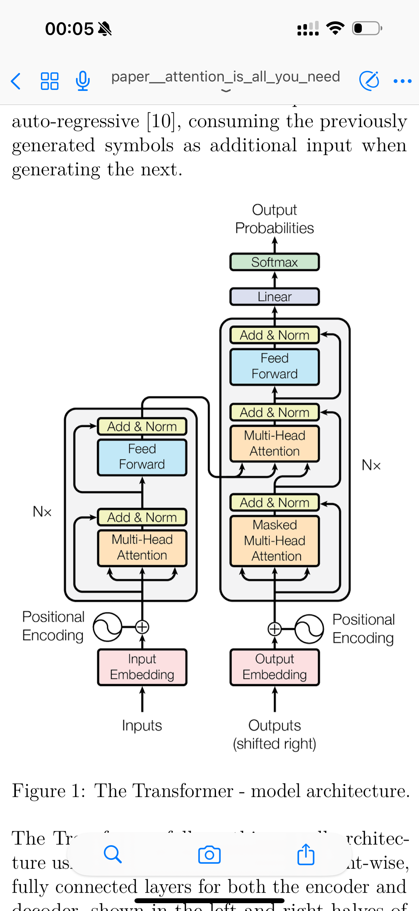
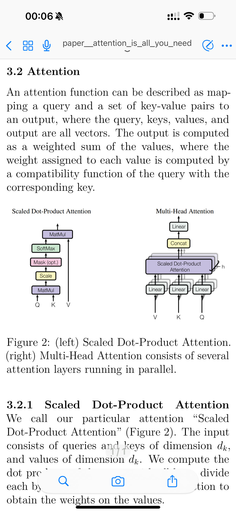
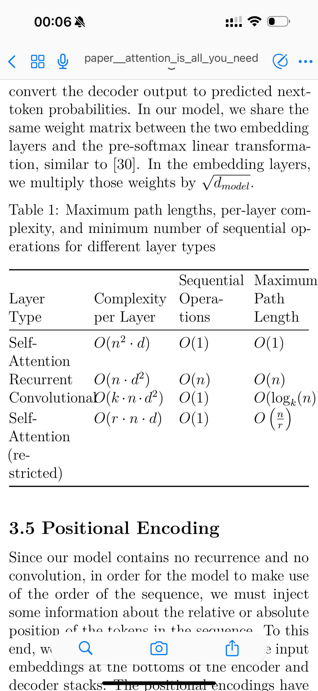

# Phone PDF: let you read PDF files--books, papers, notes on your phone easily

**This project is intended solely for study and educational purposes. Any use of the content or results outside of this context is not permitted.**

<div style="display: flex; justify-content: space-between;">
  
  
  
</div>

# File list

File name format:

```
<type>__<file_name>__<desc>.pdf
```

type can be: book, paper, notes

e.g paper__attention_is_all_you_need.pdf


## Papers

1. Paper: attention is all you need 
   [Attention Is All You Need](./paper__attention_is_all_you_need__v1.pdf)

## Books

## Notes
